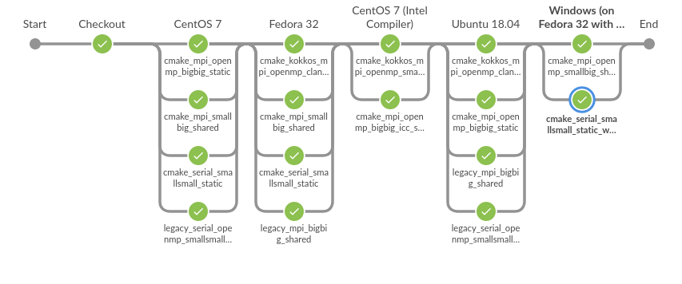

# LAMMPS Test Suite

This repository contains code and examples that drive the testing on
[ci.lammps.org](https://ci.lammps.org). It's is run on hardware that is hosted
at Temple University.

The tools provided here can also be installed locally for testing on a workstation.

`lammps_test` is a utility to compile LAMMPS in different configurations on
various environments using containers and perform compilation, run, regression, and unit tests.

## Prerequisites

* Singularity (https://sylabs.io/guides/3.5/user-guide/)

## Installation

```bash
# regular install
python setup.py install

# for development install
python setup.py develop
```

## Configuration

```bash
# Example configuration in ~/.bashrc
export LAMMPS_DIR=$HOME/GitHub/lammps/lammps
export LAMMPS_TESTING_DIR=$HOME/GitHub/lammps/lammps-testing
export LAMMPS_CACHE_DIR=$HOME/GitHub/lammps/cache
export LAMMPS_COMPILE_NPROC=24
```

`LAMMPS_DIR`
LAMMPS source directory

`LAMMPS_TESTING_DIR`
LAMMPS testing source directory

`LAMMPS_CACHE_DIR`
Directory storing compiled binaries and containers

## Basic Usage

The general idea behind `lammps_test` is to provide similar feedback to a LAMMPS commit to what is available when running on `ci.lammps.org`. The main benefit of running it locally on your workstation is that you have the same exact binaries and output folders as on the CI server.

When you type `lammps_test status` what you get is a full report of the current testing status of the HEAD commit in your LAMMPS git checkout (specified by `LAMMPS_DIR`).

```bash
$ lammps_test status
Compilation Tests:
 ⭕ centos7/cmake_mpi_openmp_bigbig_static (4a048e3f)
 ⭕ centos7/cmake_serial_smallsmall_static (4a048e3f)
 ⭕ centos7/cmake_mpi_smallbig_shared (4a048e3f)
 ⭕ centos7/legacy_serial_openmp_smallsmall_static (4a048e3f)
 ⭕ fedora/cmake_kokkos_mpi_openmp_clang_shared (4a048e3f)
 ⭕ fedora/cmake_serial_smallsmall_static (4a048e3f)
 ⭕ fedora/cmake_mpi_smallbig_shared (4a048e3f)
 ⭕ fedora/legacy_mpi_bigbig_shared (4a048e3f)
 ⭕ intel/cmake_mpi_openmp_bigbig_icc_static (4a048e3f)
 ⭕ intel/cmake_kokkos_mpi_openmp_smallbig_icc_shared (4a048e3f)
 ⭕ intel_oneapi/cmake_mpi_openmp_bigbig_oneapi_static (4a048e3f)
 ⭕ intel_oneapi/cmake_kokkos_mpi_openmp_smallbig_oneapi_shared (4a048e3f)
 ⭕ ubuntu/cmake_mpi_openmp_bigbig_static (4a048e3f)
 ⭕ ubuntu/legacy_mpi_bigbig_shared (4a048e3f)
 ⭕ ubuntu/legacy_serial_openmp_smallsmall_static (4a048e3f)
 ⭕ windows/cmake_mpi_openmp_smallbig_shared_win64 (4a048e3f)
 ⭕ windows/cmake_serial_smallsmall_static_win32 (4a048e3f)

Run Tests:
 ⭕ ubuntu/cmake_testing_serial (4a048e3f)
 ⭕ ubuntu/cmake_testing_mpi (4a048e3f)
 ⭕ ubuntu/cmake_testing_openmp (4a048e3f)

Regression Tests:
 ⭕ ubuntu/cmake_regression_mpi (4a048e3f)

Unit Tests:
 ⭕ ubuntu/cmake_mpi_openmp_smallsmall_shared (4a048e3f)
 ⭕ ubuntu/cmake_mpi_openmp_smallbig_shared (4a048e3f)
 ⭕ ubuntu/cmake_mpi_openmp_bigbig_shared (4a048e3f)
 ⭕ ubuntu_gpu/cmake_gpu_cuda_double_smallbig_clang_shared (4a048e3f)
 ⭕ ubuntu_gpu/cmake_gpu_cuda_single_bigbig_static (4a048e3f)
 ⭕ ubuntu_gpu/cmake_gpu_opencl_double_bigbig_shared (4a048e3f)
 ⭕ ubuntu_gpu/cmake_gpu_opencl_mixed_smallbig_clang_static (4a048e3f)
```

As you execute other `lammps_test` subcommands, this status is updated. Before running tests, you will need the LAMMPS containers.

## Containers

To make builds reproducible, `lammps_test` uses Singularity containers for
building all binaries. Singularity must be installed and the current user must
have `sudo` rights to build containers.

Container definitions are located in `containers/singularity/`, built
containers are stored in `$LAMMPS_CACHE_DIR/containers/`.

While you can create containers in any way you want using the `singularity`
command-line, there is a utility command for building one or more containers
with `lammps_test`:

```bash
# builds all container definitions at once
lammps_test env build ALL

# only build ubuntu18.04 container
lammps_test env build ubuntu18.04

# build multiple containers
lammps_test env build ubuntu18.04 centos7 fedora30_mingw
```

## Compilation Tests

The compilation tests done by the LAMMPS Jenkins server executes several bash
scripts on multiple containers. Each environment that should be tested defines
a YAML file in the `scripts/` folder. Currently it has 7 definitions:

* ubuntu.yml
* ubuntu_gpu.yml
* centos7.yml
* fedora.yml
* intel.yml
* intel_oneapi.yml
* windows.yml

Each of these environment defines a list of `builds` and the used
`singularity_image`. The names of the builds correspond to bash scripts located
in `scripts/builds/<BUILD_NAME>.sh`.

These build scripts assume the necessary environment variables described above
are defined and will compile LAMMPS in the current working directory.
`lammps_test compile` is a wrapper command that create the necessary
working directory inside of the `$LAMMPS_CACHE_DIR` folder, and then launches
these scripts inside the correct container.

On ci.lammps.org, these tests are one environment at a time, running multiple compilations in parallel. Below is a visualization of the current compilation test pipeline that both runs for the [develop](https://ci.lammps.org/blue/organizations/jenkins/dev%2Fdevelop%2Fcompilation_tests/activity) branch (current development version of LAMMPS) and each pull request.



### Running compilation tests locally

You can build all compilation tests at once as follows:

```bash
# this will launch all ubuntu, centos and windows compilation tests
lammps_test compile
```

To limit the compilation tests use the environment name as selector:

```bash
# only run ubuntu compilation tests
lammps_test compile ubuntu
```

If only a few builds in an environment should be run specify them with their full name:


```bash
# only run 'cmake_mpi_smallbig_shared' compilation test on ubuntu
lammps_test compile ubuntu/cmake_mpi_smallbig_shared

# run two compilations tests on ubuntu
lammps_test compile ubuntu/cmake_serial_smallsmall_static ubuntu/cmake_mpi_smallbig_shared

# run only legacy compilation tests
lammps_test compile ubuntu/legacy*
```

## Build directories

Each build will create its own working directory based on the current Git SHA
of the `LAMMPS_DIR` checkout.

It will be located in: `$LAMMPS_CACHE_DIR/builds_<CURENT_LAMMPS_SHA>/<CONFIG_NAME>/<BUILD_NAME>`

### Example:

```bash
lammps_test compile ubuntu/cmake_mpi_smallbig_shared
```

will create the folder:
`$LAMMPS_CACHE_DIR/builds_<CURENT_LAMMPS_SHA>/ubuntu/cmake_mpi_smallbig_shared`

To modify this behaviour and use the same build directory, independent of the current SHA, use the `--ignore-commit` option:

### Example:

```bash
lammps_test compile --ignore-commit ubuntu/cmake_mpi_smallbig_shared
```

will create the folder:
`$LAMMPS_CACHE_DIR/builds/ubuntu/cmake_mpi_smallbig_shared`

## Run Tests

Run tests define a set of test cases which will execute LAMMPS input scripts.
We only observe if the test case completes without an error. Similar to
compilation tests, each configuration can define a list of `run_tests` in
their YAML file. The names correspond to folders in the
`scripts/run_tests` directory.

```yaml
display_name: 'Ubuntu 18.04'
container_image: 'ubuntu18.04'
builds:
 - cmake_kokkos_mpi_openmp_clang_shared
 - cmake_mpi_openmp_bigbig_static
 - legacy_mpi_bigbig_shared
 - legacy_serial_openmp_smallsmall_static

run_tests:
 - cmake_testing_serial
 - cmake_testing_mpi
 - cmake_testing_openmp
```

Each run test consists of two scripts:

build.sh:
    A script which compiles a LAMMPS binary for testing

test.sh:
    A script which launches the test suite


To launch all run tests at once use the `lammps_test run` command:

```bash
# this will launch all ubuntu, centos and windows run tests
lammps_test runtest
```

To only test a single environment:

```bash
# only run a single ubuntu run tests
lammps_test runtest run ubuntu/*
```

To further limit the run tests to invividual builds, specify each build individual:


```bash
# Launch serial run tests on ubuntu
lammps_test runtest run ubuntu/cmake_testing_serial

# Lauch MPI and OpenMP run tests on ubuntu
lammps_test runtest run ubuntu/cmake_testing_mpi ubuntu/cmake_testing_openmp
```

## Regression Tests

Regression tests are similar to run tests. However, they not only require
scripts to complete without an error, but that their generated outputs are
"identical" to the ones of a reference run.

Regression tests are defined for each configuration by adding a
`regression_tests` list to their YAML file. The names correspond to folders
in the `scripts/regression_tests` directory.

```yaml
display_name: 'Ubuntu 18.04'
container_image: 'ubuntu18.04'
builds:
 - cmake_kokkos_mpi_openmp_clang_shared
 - cmake_mpi_openmp_bigbig_static
 - legacy_mpi_bigbig_shared
 - legacy_serial_openmp_smallsmall_static

...

regression_tests:
 - cmake_regression_mpi
```

Each regression test consists of two scripts:

build.sh:
    A script which compiles a LAMMPS binary for testing

test.sh:
    A script which launches the test suite


To launch all regressions tests at once use the `lammps_test reg` command:

```bash
# this will launch all ubuntu, centos and windows regression tests
lammps_test reg run
```

To only test a single environment specify the environment name:

```bash
# only run ubuntu regression tests
lammps_test reg run ubuntu
```

To further limit the regression tests to individual builds, specify the full name:

```bash
# Launch serial regression tests on ubuntu
lammps_test reg run ubuntu/cmake_regression_mpi
```

> **NOTE**:  Both `lammps_test runtest` and `lammps_test reg` have the `--build-only` and `--test-only` option. Use them to avoid one of the two phases.
